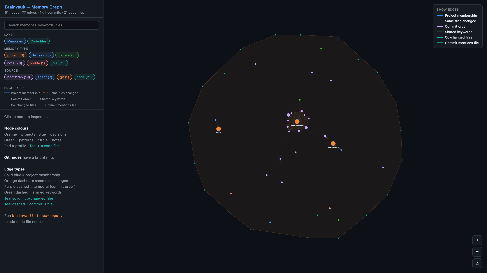

<div align="center">
  
  <h1>Brainvault</h1>
  <p>Personal memory layer for Claude Code.<br/>Stores what you've built, how you think, and decisions you've made — across every session, every project, every agent.</p>
  <p>
    
    
    
    
  </p>
</div>

---

SQLite + FTS5 + optional semantic search + MCP. Zero infrastructure. One install command.

---

## Table of Contents

- [The Problem](#the-problem)
- [The Mental Model](#the-mental-model)
- [Install](#install)
- [What Happens During a Session](#what-happens-during-a-session)
- [Memory Types](#memory-types)
- [When Value Accrues](#when-value-accrues)
- [MCP Tools](#mcp-tools)
- [CLI Commands](#cli-commands)
- [Code Intelligence](#code-intelligence)
- [Git History Mining](#git-history-mining)
- [Session Auto-Capture](#session-auto-capture)
- [Semantic Search](#semantic-search)
- [The Memory Graph](#the-memory-graph)
- [What Brainvault Does Not Do](#what-brainvault-does-not-do)
- [Storage and Privacy](#storage-and-privacy)
- [Project Structure](#project-structure)
- [Development](#development)

---

## The Problem

Every AI coding session starts cold. You open Claude Code and — even if you were just working in this repo an hour ago — the agent has no memory of it. You explain your stack, your constraints, why you chose PostgreSQL over MongoDB, why you're not using Docker, what the auth approach is. Every. Single. Session.

It's worse across projects. You spent three weeks figuring out the right way to structure async workers in Project A. Now you're in Project B and facing the same decision. The agent has no idea Project A ever existed.

And even within a project, the *reasoning* disappears. Six months from now you'll look at a decision and wonder why. There's code, maybe some comments, but the actual thought process — the alternatives you rejected, the constraint that forced your hand, the trade-off you consciously made — that's gone. The commit message says "refactor auth middleware" but not *why*.

Brainvault fixes this. It gives Claude Code a persistent memory that carries forward across sessions and across projects, captures the reasoning behind decisions (not just the outcome), and makes that knowledge instantly searchable.

---

## The Mental Model

Think of Brainvault as a second brain that lives alongside your code.

**Claude Code is the agent.** It does the work — reads files, writes code, runs tests. But it forgets everything when the session ends.

**Brainvault is the memory.** It runs as a local MCP server that Claude Code connects to automatically. Claude calls its tools silently in the background — you never have to think about it. Every session starts with context loaded, every significant thing you say or decide gets saved, every session end auto-captures a structured summary.

**The vault grows with you.** Start with nothing. After one session you have your profile and stack saved. After a week you have patterns and decisions. After a month you have a queryable history of how you think and build. Import your git history and you have years of architectural decisions in minutes.

**Claude reads from it proactively.** Before recommending an auth approach, it searches for auth memories. Before starting work on a feature, it calls `get_code_context` to understand which files are involved without reading the entire codebase. The richer the vault, the less you re-explain.

---

## Install

```bash
pip install brainvault
brainvault install
```

Restart Claude Code. That's it.

### What the installer does

**Step 1 — Database**
Creates `~/.brainvault/memory.db` with the full schema (memories, projects, vector embeddings, git scan deduplication, code intelligence tables). Safe to re-run — existing data is never touched.

**Step 2 — MCP server registration**
Adds to `~/.claude/settings.json`:
```json
"mcpServers": {
  "brainvault": {
    "command": "/path/to/python",
    "args": ["-m", "brainvault.mcp_server"]
  }
}
```
Claude Code auto-starts the MCP server on launch and keeps it connected for the entire session.

**Step 3 — Stop hook**
Adds to `~/.claude/settings.json`:
```json
"hooks": {
  "Stop": [{ "hooks": [{ "type": "command", "command": "python -m brainvault.capture" }] }]
}
```
This fires `brainvault.capture` after every agent turn. It silently checks for Claude-generated continuation summaries and saves them to the vault.

**Step 4 — CLAUDE.md instructions**
Injects a managed block into `~/.claude/CLAUDE.md` that instructs Claude to:
- Call `get_my_context()` silently at the start of every session
- Save decisions, patterns, and profile info proactively during the session
- Search memories before making architectural recommendations
- Record outcomes when you report what happened with past decisions
- Never ask for permission — operate silently in the background

Re-running `install` upgrades the block in-place using start/end markers without touching your surrounding content.

**Step 5 — Vault seeding (automatic)**
Immediately after setup, the installer:
1. Discovers all git repos under `~/`, scans the last 12 months of history (up to 200 commits per repo), and saves significant commits as memories — so your vault has real data from the first session
2. Walks `~/.claude/projects/` and imports all past Claude Code continuation summaries

Press Ctrl+C to skip either step. Both are idempotent — safe to run again later.

### Re-installing / upgrading

`brainvault install` is fully idempotent. Already-registered settings are skipped. The CLAUDE.md block is upgraded if the content has changed. The DB schema applies additive migrations only — no data loss.

---

## What Happens During a Session

You don't change how you work. Everything below happens automatically.

### Session start

Claude calls `get_my_context()` before your first message. It receives:
- Your profile (role, preferences, working style)
- Active projects with their stack and notes
- Projects that have gone stale (no activity in 30+ days) — so Claude can ask if they're still relevant
- Open decisions older than 7 days that have no recorded outcome
- Vault stats (memory count, git repos indexed)

This takes ~50ms and uses ~1–2K tokens. The cold-start problem is solved before you type anything.

### During the session

**You say something about yourself** → Claude saves a `profile` memory.
> "I prefer explicit error handling over exceptions"
> → saved as `profile`, no project scope

**You make a technical decision** → Claude saves a `decision` memory with the full reasoning.
> "Let's use JWT here — we need to be stateless for horizontal scaling"
> → saved as `decision` scoped to current project, content includes *why*

**You establish a pattern** → Claude saves a `pattern` memory.
> "Always add an integration test alongside any new API endpoint in this project"
> → saved as `pattern`

**You work on something architectural** → Claude searches before recommending.
> You ask about caching strategy
> → Claude calls `search_memory("caching")` first, finds what you decided for a past project, surfaces it before answering

**You explicitly ask to remember something**
> "Remember that we decided against GraphQL because the team doesn't have experience with it"
> → saved immediately, never requires a separate command

### Session end

The Stop hook fires. `brainvault.capture` scans the session JSONL file for a Claude-generated continuation summary (the structured summary Claude writes when context runs out). If found, it's chunked by markdown section and saved as `note` memories. This is the highest-quality memory source — Claude wrote it specifically to preserve context.

---

## Memory Types

| Type | What it captures | Example |
|---|---|---|
| `profile` | Who you are — role, preferences, working style, non-negotiables | "I'm a solo developer, prefer minimal dependencies, never use Docker in personal projects" |
| `decision` | An architectural or technical choice, including the reasoning and constraints that led to it | "Chose SQLite over PostgreSQL — no concurrent writes, single-server deploy, zero ops overhead" |
| `pattern` | A repeatable approach you always use in certain situations | "Always implement retry logic with exponential backoff for any external API call" |
| `note` | Anything else worth keeping — session summaries, observations, open questions | Auto-captured continuation summaries from Claude Code sessions |

### When to use each type

**`profile`** — use for things that are true about *you*, not a specific project. Your language preferences, your philosophy on testing, how you think about trade-offs. These travel across every project.

**`decision`** — use for choices that were *non-obvious* and had a reason. If you'd want to know six months later why you did it this way, save it as a decision. Capture the alternatives you rejected and why. Record the outcome later with `record_outcome` so the feedback loop closes.

**`pattern`** — use for "we always do X when Y". The value is that Claude starts applying these patterns without being told in every session.

**`note`** — mostly auto-populated by the Stop hook. You rarely need to save these manually.

---

## When Value Accrues

Brainvault compounds. Here is an honest timeline:

### Day 1 — after install

Your vault has:
- Git history memories from across your local repos (if you said yes to seeding)
- Past session summaries from `~/.claude/projects/` (if imported)

First session: Claude loads context, finds the git memories, and already knows the major decisions that shaped your existing projects. You don't explain anything.

### After 1 week

You've had several sessions. The vault has:
- Your profile saved (Claude inferred your role, stack preferences, working style)
- Several decisions with reasoning from active projects
- A few patterns established
- Session summaries from each session end

Opening a project: Claude loads context in 1-2K tokens instead of you spending 10 minutes re-explaining. The first meaningful thing you say is code, not orientation.

### After 1 month

Enough decisions have accumulated that `reflect` becomes interesting:
- Some decisions from week 1 have outcomes recorded ("that worked", "we rolled it back")
- Cross-project patterns are visible — the same architectural approaches appearing across different projects
- Stale decisions surface (you made a call 3 weeks ago and never followed up — is it still relevant?)

Switching between projects is seamless. Claude picks up each project's context from its memories, not from re-reading every file.

### After 6 months

The vault is a genuine record of how you think and build. `reflect` shows:
- Your actual decision track record — which types of choices have positive outcomes, which tend to get reversed
- Recurring architectural themes across projects
- Knowledge gaps (topics you keep revisiting without a settled pattern)

New projects start faster because Claude already knows your defaults. You spend less time repeating yourself and more time on novel problems.

### The git seeding effect (retroactive)

If you ran `bootstrap-git ~` on install, you didn't have to wait for any of this. Every significant commit across your entire local history is already in the vault on day 1. A project you haven't touched in 2 years has its major refactors, migrations, and architectural changes already saved as searchable memories. The timeline above compresses dramatically.

---

## MCP Tools

These are the tools Claude Code calls automatically. You generally don't invoke them directly — they run in the background as part of normal conversation.

| Tool | When Claude calls it | What it returns |
|---|---|---|
| `get_my_context` | Start of every session, silently | Your profile, active projects, open decisions, stale project warnings, vault stats |
| `save_memory` | When you state a decision, pattern, preference, or ask to remember something | Confirmation with the assigned memory ID |
| `search_memory` | Before making architectural recommendations, when you ask "do you remember..." | Ranked list of matching memories with content, type, project, and access count |
| `register_project` | When you start working in a new project or update an existing one | Confirmation; updates `last_active` timestamp |
| `get_project` | When you need everything known about a specific project | Project metadata (stack, description, notes) + all memories scoped to it |
| `record_outcome` | When you say "that worked", "we had to revert that", "that caused issues" | Saves outcome text and sentiment (positive/negative/mixed) against the decision memory |
| `reflect` | When you ask about patterns, gaps, or retrospectives | Open decisions, cross-project keyword patterns, outcome sentiment breakdown, stale projects |
| `update_memory` | When you say "actually, update that" or "that's no longer true" | Updates content/type/project in-place; re-embeds if content changes |
| `forget` | When you explicitly ask to remove a memory | Deletes the memory and its vector embedding |
| `get_code_context` | Before starting non-trivial feature work on an indexed repo | Relevant memories + ranked files + co-change partners for the query topic |

### `get_code_context` in detail

This is the most powerful tool for active development. Instead of Claude reading 10–15 files to orient itself before starting a feature, it calls:

```
get_code_context(project="myapp", query="auth refresh token")
```

And gets back:
- Memories about auth decisions (from past sessions and git history)
- Files mentioned in matching git commit memories
- Co-change partners — files that historically change together with the relevant files (usually: the implementation, its test, its schema, its middleware)
- Files whose path matches query terms

The agent then reads only the 3–5 files that actually matter, not the whole tree. On a large codebase this saves 20–40K tokens per session and produces better suggestions because they're grounded in your actual history, not generic patterns.

---

## CLI Commands

For use from the terminal. Most of the vault interaction happens automatically through Claude, but these commands let you inspect, manage, and seed the vault manually.

```bash
# Setup
brainvault install
    # Full setup: MCP server, Stop hook, CLAUDE.md injection.
    # Auto-seeds vault from git history and past sessions on first run.
    # Safe to re-run — idempotent.

# Project onboarding
brainvault init
    # Interactive onboarding: name, stack, goals, constraints, alternatives considered.
    # Creates a project record and optionally saves alternatives as a decision memory.

# Vault seeding
brainvault bootstrap
    # Import all past Claude Code session continuation summaries from ~/.claude/projects/.
    # Idempotent — already-imported sessions are skipped.

brainvault bootstrap-git [path]
    # Discover all git repos under path (default: ~/), scan each for significant commits.
    # Saves refactors, migrations, large diffs, and keyword-significant commits as memories.
    # Idempotent — already-scanned commits are skipped.

brainvault git-scan [path] [--project <name>] [--since <date>] [--limit <n>]
    # Scan a single repo's git history. More control than bootstrap-git.
    # --since defaults to 1 year ago. --limit defaults to 500 commits.
    # --project defaults to the directory name.

brainvault index-repo [path] [--project <name>] [--min-cochange <n>]
    # Index a repo's file structure and co-change matrix for get_code_context.
    # Walks all source files, detects language, extracts imports.
    # Builds a co-change matrix from git history (which files change together).
    # --min-cochange: minimum co-occurrences to record a pair (default: 2).

# Search and inspect
brainvault search <query> [--project <name>]
    # Full-text search from the terminal. Same FTS5 + optional semantic search as the MCP tool.
    # Useful for verifying what's in the vault without opening Claude Code.

brainvault status
    # Vault health at a glance:
    #   - Total memories by type and source
    #   - Number of memories without embeddings
    #   - Git repos scanned, git memories saved
    #   - Last session captured
    #   - Open decisions older than 7 days
    #   - Stale active projects

brainvault reflect
    # Surfaces:
    #   - Open decisions with no recorded outcome (>7 days old)
    #   - Cross-project keyword patterns (topics appearing in 2+ projects)
    #   - Outcome sentiment breakdown (positive/negative/mixed decisions)
    #   - Stale active projects
    #   - Most-accessed memories (your most-recalled knowledge)

brainvault stats
    # Memory counts broken down by type and project.

# Memory management
brainvault update <id> [--content <text>] [--type <type>] [--project <name>]
    # Edit an existing memory. Get the ID from search or status output.
    # Updating content re-extracts keywords and re-embeds the vector.

brainvault forget <id>
    # Delete a memory by ID. Also removes its vector embedding.

# Extras
brainvault embed
    # Backfill semantic vector embeddings for all memories that don't have one.
    # Required after installing brainvault[semantic] on an existing vault.
    # First run downloads BAAI/bge-small-en-v1.5 (~130MB) to ~/.cache/huggingface.

brainvault graph [--open]
    # Generate a self-contained HTML brain graph of all memories.
    # Written to ~/.brainvault/graph.html. --open launches it in the default browser.
    # See "The Memory Graph" section for what this is useful for.
```

---

## Code Intelligence

The `index-repo` command + `get_code_context` MCP tool form the code intelligence layer — the "Graphify" aspect of Brainvault.

### What indexing builds

Run once per repo (and re-run after significant changes):

```bash
brainvault index-repo . --project myapp
```

**Pass 1 — File structure**
Walks the repo, skips noise directories (`node_modules`, `.venv`, `DerivedData`, etc.), detects language by extension, extracts imports via regex. Stores in the DB:

```
auth/jwt.py          python    imports: [hmac, datetime, jose]
auth/middleware.py   python    imports: [jwt, fastapi, starlette]
tests/test_auth.py   python    imports: [pytest, auth.jwt, auth.middleware]
api/routes.py        python    imports: [fastapi, auth.middleware]
```

Supported languages: Python, JavaScript, TypeScript, Go, Dart, Ruby, Java, Kotlin, Rust.

**Pass 2 — Co-change matrix**
A single `git log --name-only` call reads the entire history. For each commit, every pair of source files that appeared together is counted:

```
auth/jwt.py  ↔  tests/test_auth.py      47 co-occurrences
auth/jwt.py  ↔  auth/middleware.py      31 co-occurrences
schema/user.py  ↔  migrations/0012.py   8 co-occurrences
```

This is structural memory the codebase has built up over time. Files that always change together are coupled — regardless of what the folder structure implies.

### What Claude gets before starting work

```
get_code_context("myapp", "auth refresh token")
```

Returns:
```
## Relevant memories
[decision] Used JWT with short expiry + refresh tokens — sessions don't work
           across our mobile/web split. (2024-08-12, project: myapp)

[git] a3f91c: refactor auth token flow — revoked old session approach
      Date: 2024-08-10 | Changed: 4 files, +120 -89 lines
      Files: auth/jwt.py, auth/middleware.py, tests/test_auth.py

## Ranked files
1. auth/jwt.py           — mentioned in matching git commit
   Co-changes with: tests/test_auth.py (47×), auth/middleware.py (31×)
2. auth/middleware.py    — mentioned in matching git commit
3. tests/test_auth.py   — co-changes with auth/jwt.py (47×)
4. auth/refresh.py      — file path matches "auth"
```

Claude reads those 4 files and starts work. Without this, it would read 10–15 files to orient.

### When to re-index

- After a major refactor that moves files around
- After adding a new significant module
- `bootstrap-git` calls `index-repo` automatically for each repo it scans, so the initial seed is always up to date

### Honest limits

- **File-level only** — knows `auth/jwt.py` is relevant, not which function inside it
- **Regex import extraction** — works for 90%+ of cases; misses dynamic imports and eval-based loading
- **Co-change from history only** — new files with no commits have no co-change data yet
- **No call graph or type graph** — that would require language servers and significant complexity

---

## Git History Mining

```bash
brainvault git-scan . --project myapp --since 2023-01-01 --limit 500
# or for all repos at once:
brainvault bootstrap-git ~/Projects
```

### What gets saved

Not every commit — only significant ones. A commit is significant if any of these are true:
- Contains a keyword: `refactor`, `migrate`, `add`, `implement`, `fix`, `remove`, `replace`, `introduce`, `redesign`, `upgrade`
- Is a merge commit (not noise/WIP merges)
- Changes more than 5 files
- Has more than 50 lines changed

Noise is filtered: WIP commits, auto-merge, dependabot, dependency bumps are all excluded. Trivial single-file changes with ≤10 lines are excluded.

### What a saved memory looks like

```
[git] a3f91c: refactor auth middleware to use JWT
Date: 2024-08-10
Author: Sumith <sumith@example.com>
Changed: 4 files, +120 -89 lines
Files: auth/jwt.py, auth/middleware.py, tests/test_auth.py, api/routes.py
```

Tagged `source="git"` so you can filter them. Memory type is inferred from the commit keyword: `refactor`/`migrate`/`remove` → `decision`, `add`/`implement`/`introduce` → `pattern`, `fix` → `note`.

### Idempotency

Every scanned commit hash is recorded in `git_commits_scanned`. Re-running `bootstrap-git` or `git-scan` skips already-processed commits. Safe to run repeatedly as new commits land.

---

## Session Auto-Capture

The Stop hook fires `brainvault.capture` after every agent turn.

### What it captures

Only Claude-generated continuation summaries — the structured summary Claude writes at the start of a continuation session when context runs out. These are high-quality because Claude wrote them specifically to preserve the most important context from the session.

The summary is chunked by markdown section (each `##` heading becomes a separate memory) so individual sections are searchable without noise from unrelated parts of the same session.

### What it does NOT capture

- Raw conversation turns — too noisy, low signal
- Things you said that Claude didn't save as a memory — if you didn't explicitly state a decision and Claude didn't infer it, it's not automatically saved
- Code changes — those live in git

### Project name detection

The session file lives at `~/.claude/projects/-Users-sumithsb-Projects-myapp/abc123.jsonl`. The directory name encodes the original path — `capture.py` decodes it to derive the project name (`myapp`), so memories are scoped correctly without any configuration.

---

## Semantic Search

By default, search uses SQLite FTS5 (full-text search with BM25 ranking). This is fast and works well for keyword queries.

For semantic search — finding memories that are *conceptually* related even if they don't share keywords — install the extras:

```bash
pip install 'brainvault[semantic]'
brainvault embed    # backfill embeddings for existing memories (~130MB model download on first run)
```

This adds:
- **fastembed** for local embedding generation (BAAI/bge-small-en-v1.5, runs entirely on-device, no API calls)
- **sqlite-vec** for vector similarity search stored directly in SQLite
- **Reciprocal Rank Fusion** blending of BM25 and cosine similarity rankings

### How RRF works

Both FTS5 and vector search return ranked lists. RRF combines them: `score = 1/(60 + fts_rank) + 1/(60 + vec_rank)`. Documents appearing high in both lists score highest. Neither rank scale is assumed to be comparable — only rank position matters.

### When semantic search makes a difference

- **FTS5 is good for:** Exact terms, technical names, file paths, known keywords
- **Semantic is better for:** Concepts without consistent terminology, "decisions about scaling" when memories say "horizontal growth", conceptual synonyms

For most vault queries, FTS5 alone is sufficient. Semantic search adds value once the vault is large (100+ memories) and queries become more conceptual.

---

## The Memory Graph

```bash
brainvault graph --open
```



Generates `~/.brainvault/graph.html` — a self-contained D3.js force-directed visualization of your entire vault, including code file relationships if you've run `index-repo`.

### What you see

**Memory nodes** (circles):
- Colored by type — blue = decision, green = pattern, purple = note, red = profile, orange = project
- Sized by access count — frequently recalled memories appear larger
- Git memories marked with a bright orange ring
- Clustered into project bubbles with convex hulls

**Code file nodes** (teal diamonds) — appear after running `brainvault index-repo .`:
- One node per top-40 most-co-changed source file per repo
- Sized by cumulative co-change score
- Grouped into the same project cluster as memories

**Edge types:**
| Edge | Color | Meaning |
|---|---|---|
| Solid blue | `belongs_to` | Memory or file belongs to a project |
| Orange dashed | `file_overlap` | Two git commits touched the same file |
| Purple dashed | `temporal` | Adjacent commits in the same project |
| Green dashed | `keyword_overlap` | Two memories share ≥2 keywords |
| Teal solid | `cochange` | Two files changed together in git history |
| Teal dashed | `memory_file` | A git commit memory references this file |

**Sidebar:**
- **Layer filter** — toggle the Memories layer and Code files layer independently
- Memory type chips, source chips (agent / git / bootstrap)
- Edge type toggles — hide any edge type to reduce visual noise
- Search box — searches labels, full content, file paths, languages, keywords, authors
- Detail panel — click any node to inspect it; git nodes show a commit card, file nodes show path + language + co-change count

### The code graph layer

The teal diamond nodes and cochange edges are the structural skeleton of your codebase as git history has revealed it. They answer a different question than memories do:

- **Memories** tell you *why* things are the way they are (decisions, patterns, reasoning)
- **Code file nodes** show *what* moves together (the actual coupling revealed by 100s of commits)

Where these two layers intersect — a git commit memory connected to file nodes via `memory_file` edges — you can see at a glance which architectural decisions affected which files, and which files tend to be dragged along.

To add code nodes to your graph:
```bash
brainvault index-repo . --project myapp
brainvault graph --open
```

### When it's useful

**Sparse vault (days 1–7):** Mostly decorative. A handful of nodes doesn't tell you much beyond `brainvault status`.

**After git seeding + active use:** Genuinely useful for:
- Seeing which projects have the most decision debt (many decision nodes, few with recorded outcomes)
- Spotting cross-project clusters you didn't know existed
- Seeing the temporal chain of commits in a project — the evolution story at a glance
- Identifying which memories are most accessed (the knowledge you actually rely on)

**After `index-repo`:** The code layer reveals:
- High-betweenness files — nodes with many co-change edges are your highest-risk touch points
- Unexpected coupling — files that always move together despite being in different modules
- Which architectural decisions (memory nodes) actually affected which files (file nodes)

**Honest limitation:** It's a point-in-time snapshot, not live-updating. It's for your eyes, not Claude's — it doesn't feed back into the agent's context. Regenerate it any time with `brainvault graph`.

---

## What Brainvault Does Not Do

**It does not read your source code.** `index-repo` indexes file names, languages, and import statements — not file content. Claude Code reads the actual source. Brainvault tells Claude *which files* to read, not what's in them.

**It does not capture everything automatically.** The Stop hook captures Claude-generated summaries. Git scan captures significant commits. Everything else — decisions, patterns, profile — requires Claude to infer and save them during a session, which it does proactively but not infallibly. If you have a decision that wasn't stated clearly in conversation, it may not be saved.

**It does not sync across machines.** The vault lives at `~/.brainvault/memory.db`. It's local to the machine where brainvault is installed. There is no cloud sync, no account, no server.

**It does not replace documentation.** Brainvault captures decisions and reasoning — the *why*. It doesn't replace specs, READMEs, or architecture docs that capture the *what* in structured form for a team to read.

**It does not work with Cursor or other editors** (yet). Brainvault is Claude Code only. The MCP server runs via stdio as Claude Code expects.

**It is not a RAG system over your codebase.** It does not chunk and embed your source files for semantic retrieval. The code intelligence layer (`index-repo`) is structural — file names, imports, co-change relationships — not content-level.

---

## Storage and Privacy

Everything is local. The vault is a single SQLite file at `~/.brainvault/memory.db`. Nothing is sent anywhere — not to Anthropic, not to any external service.

The embedding model (if you install `[semantic]`) runs entirely on-device via fastembed. The model file (~130MB) is downloaded once to `~/.cache/huggingface` and never used for any network calls after that.

You can inspect the raw database at any time:
```bash
sqlite3 ~/.brainvault/memory.db "SELECT memory_type, project, content FROM memories LIMIT 10"
```

You can delete the entire vault and start fresh:
```bash
rm ~/.brainvault/memory.db
brainvault install   # re-initialises the schema
```

---

## Project Structure

```
brainvault/
├── db.py           — SQLite schema, CRUD, FTS5 full-text search, vector search,
│                     reflection queries, code intelligence reads/writes.
│                     VALID_MEMORY_TYPES constant. All migrations in _migrate().
├── mcp_server.py   — 10 MCP tools served via stdio (FastMCP)
├── capture.py      — Stop hook handler; extracts continuation summaries from JSONL session files
├── bootstrap.py    — Imports past Claude Code session history into the vault
├── installer.py    — Patches ~/.claude/settings.json + CLAUDE.md;
│                     auto-seeds vault from git history + past sessions on install
├── git_scan.py     — Mines git history for significant commits;
│                     discover_repos() for system-wide bootstrap
├── code_scan.py    — File tree walker, regex import extractor, co-change matrix builder;
│                     index_repo() orchestrator
├── embeddings.py   — Optional fastembed wrapper (BAAI/bge-small-en-v1.5, lazy singleton)
├── graph.py        — Self-contained D3.js HTML brain graph; two-layer visualization:
│                     memory nodes (circles) + code file nodes (teal diamonds) from index-repo;
│                     6 edge types including cochange and memory_file
└── cli.py          — CLI entry point (14 commands, sys.argv parsing)

~/.brainvault/
└── memory.db       — SQLite database (all memories, projects, vectors, git scan state,
                      code intelligence index)

~/.claude/
├── settings.json   — MCP server entry + Stop hook entry added by installer
└── CLAUDE.md       — Brainvault instructions injected/upgraded by installer
```

---

## Optional: Semantic Search

```bash
pip install 'brainvault[semantic]'
brainvault embed
```

Adds cosine similarity search via fastembed (BAAI/bge-small-en-v1.5) + sqlite-vec, blended with FTS5 via Reciprocal Rank Fusion. First run downloads the model (~130 MB) to `~/.cache/huggingface`.

---

## Development

```bash
git clone https://github.com/sumithsb/brainvault
cd brainvault
pip install -e ".[dev]"
pytest
```

Tests use isolated temporary databases — `~/.brainvault/memory.db` is never touched. The `mock_embeddings` fixture patches fastembed so no model download is needed.

**Requirements:** Python 3.10+, Claude Code
